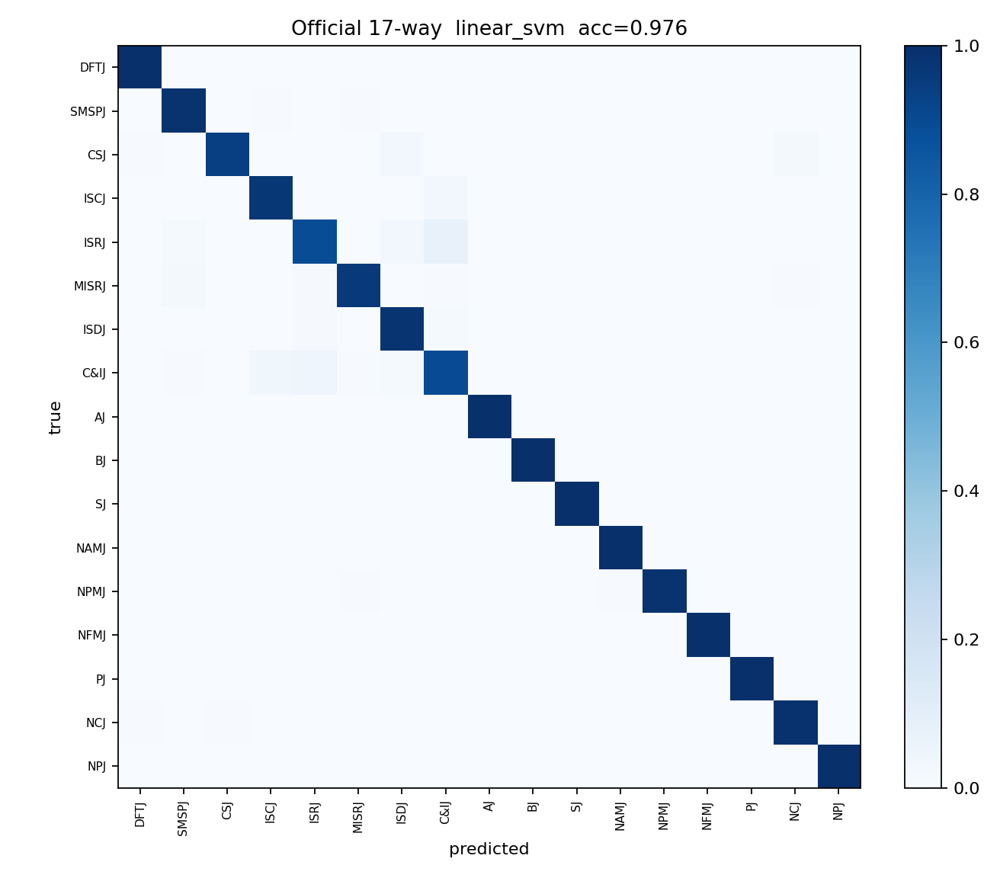
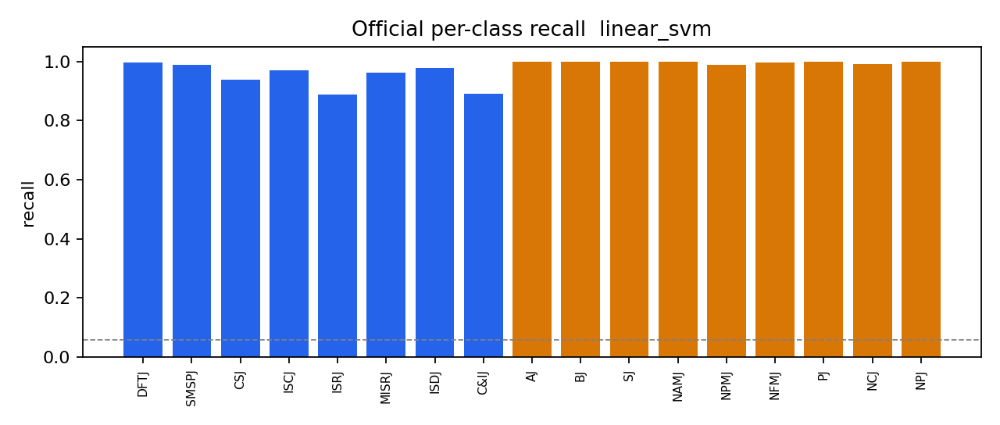
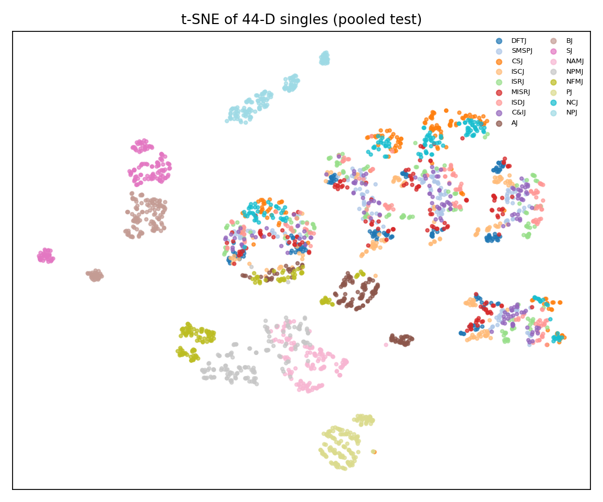

# 44 维快集：提取、评测与结论

并集特征：仓库原 22 维多域特征 + TAGPNet 30 维物理统计，去掉双谱（G1/G2，计算贵）以及近重复项 A3 `peak/mean`、B5 `norm_entropy`。  
对 `output/2D_8x9_0520` 的 train / val / test、JNR ∈ {0, 5, 10, 15, 20} 做了全量提取，并用小模型测 17 类单干扰可分性。

相关脚本（仓库根目录）：

| 文件 | 作用 |
|---|---|
| `extract_fast44.py` | 从 `*_echo_times.mat` + `*_echo_stfts.mat` 抽 44 维 |
| `eval_fast44.py` | 线性 / 树 / 小 MLP / 最近质心；出图和 JSON 报告 |
| `docs/fast44_feature_names.json` | 44 个字段名 |
| `docs/fast44_eval_report.json` | 本次评测数字 |
| `docs/figures/fast44/` | 混淆矩阵、逐类召回、t-SNE |

npz 写在 `output/2D_8x9_0520/fast44/`（`output/` 已 gitignore，需本地生成）。

---

## 依赖

```text
numpy  scipy  h5py  PyWavelets  scikit-learn  matplotlib
```

```bash
pip install numpy scipy h5py PyWavelets scikit-learn matplotlib
```

数据要求（每个 `JNR_+{n}/`）：

- `{split}_echo_times.mat` 变量 `all_times`，shape `(8000, N)`，复数
- `{split}_echo_stfts.mat` 变量 `all_stfts`，shape `(225, 224, N)`，复数
- `{split}_echo_metadata.json`

默认 `fs = 80e6`，与 `config.m` 一致。

---

## 提取

在仓库根目录：

```bash
python extract_fast44.py
```

等价于：

```bash
python extract_fast44.py --root output/2D_8x9_0520 --splits train val test --jnrs 0 5 10 15 20
```

只跑某一档：

```bash
python extract_fast44.py --splits train val --jnrs 0
```

已存在的 `{split}_JNR{n}.npz` 会跳过。全量 5×(595+255+8900) 约 7 分钟（本机）。

每个 npz 字段：

| 键 | 形状 / 类型 | 说明 |
|---|---|---|
| `X` | `(N, 44) float32` | 特征 |
| `label` | `(N,) str` | 单类名或 `D+S` |
| `njam` | `(N,) int16` | 1=单类，2=组合 |
| `jnr` | `(N,) int16` | 干噪比 |
| `sample_idx` | `(N,)` | metadata 对齐 |
| `feature_names` | `(44,)` | 列名 |

加载：

```python
import numpy as np
z = np.load("output/2D_8x9_0520/fast44/test_JNR0.npz", allow_pickle=True)
X, y, njam = z["X"], z["label"], z["njam"]
```

---

## 44 维定义

共享中间量：幅度统计 \(O(N)\)、I/Q 相位、一次 `rfft`、已有复数 STFT、db4 五层 DWT。不含双谱。

| 组 | 维 | 名称 |
|---|---|---|
| A 时域幅度 | 7 | `papr` `rms_mean` `peak_rms` `amp_var` `env_cv` `peak_pos_ratio` `zcr` |
| B 高阶 / 熵 | 6 | `skewness` `kurtosis` `shannon_entropy` `exp_entropy` `energy_concentration` `carrier_factor` |
| C 频域 | 7 | `spec_centroid` `spec_bandwidth` `spec_flatness` `spec_peak_count` `spec_entropy` `spec_skew` `spec_kurt` |
| D 瞬时频率 / 相位 | 7 | `ifreq_mean` `ifreq_std` `ifreq_roc_std` `amp_phase_corr` `freq_chg_rate_ratio` `mod_bandwidth` `mod_rate` |
| E STFT | 5 | `stft_max_mean` `stft_std_mean` `stft_std_time` `stft_std_freq` `stft_phase_diff_std` |
| F 小波 | 12 | `wav_e_approx` `wav_e_d_coarse` `wav_e_d_mid` `wav_e_d_high` `wav_var` `wav_abs_mean` `wav_max` `wav_m2` `wav_m3` `wav_m4` `wav_scale_centroid` `wav_max_sv` |

与 MATLAB 22 维的差别：这里对复数 I/Q 用 `|s|` 和 `angle(s)`，不用 `real(s)+Hilbert`；STFT 五维来自已存复数谱；小波能量比按 TAGPNet 的 LF / 粗细节 / 中细节 / 高频拆。

相对 TAGPNet 30 维：补了你们原 22 维里多出的包络、谱偏度/峰度、小波矩与 SVD；砍掉占位维和双谱。

---

## 评测

```bash
python eval_fast44.py
python eval_fast44.py --fast44-dir output/2D_8x9_0520/fast44 --jnrs 0 5 10 15 20
```

三个协议：

| 协议 | 设置 | 目的 |
|---|---|---|
| `official_17way` | 官方 train+val 单类 → test 单类，跨 5 档 JNR | 闭集可分性 |
| `pooled_17way` | 全部单类 70/30 分层 | 特征空间容量 |
| `presence_single_vs_combo` | 仅在 test 上 70/30（官方 train 无组合） | 单/组合诊断，**不是**严格 CZSL 路由 |

模型：Nearest Centroid、LogReg、Linear SVM、RF、MLP `44→64→32`。除 RF 外均 `StandardScaler`。

产出：`output/.../fast44/eval_report.json` 与 `eval_plots/`。仓库里的副本见 `docs/fast44_eval_report.json` 与 `docs/figures/fast44/`。

---

## 本次运行结论（2D_8x9_0520）

数据：train 35/类 ×17 ×5 JNR = 2975；val 15/类 → 1275；test 单类 100/类 → 8500，组合 7200/档。

### 官方 17 类（train+val=4250，test=8500）

| 模型 | acc | macro-F1 | D/S 两组 |
|---|---|---|---|
| **Linear SVM** | **0.976** | 0.975 | 0.997 |
| LogReg | 0.972 | 0.972 | 0.996 |
| RF | 0.968 | 0.968 | 0.992 |
| MLP 44→64→32 | 0.963 | 0.963 | 0.995 |
| Nearest centroid | **0.661** | 0.666 | 0.910 |
| 随机 | 0.059 | — | 0.50 |

SVM 最难点：ISRJ 0.888、C&IJ 0.892、CSJ 0.938。压制类接近 1.0。





### 打乱 70/30

Linear SVM **0.983**，MLP 0.981。特征空间本身可分，不是划分运气。



t-SNE（2D）里压制类成岛，欺骗类按 JNR 绕环、看起来更混；线性模型在 44 维里仍能切开。不要用 2D 图否定 97% 的线性可分。

### 单类 vs 组合（test 70/30，用了组合标签）

| 模型 | acc | 单类召回 | 组合召回 |
|---|---|---|---|
| MLP | 0.993 | 0.983 | 0.996 |
| RF | 0.990 | 0.947 | 1.000 |
| LogReg | 0.942 | 0.796 | 0.976 |

44 维里有存在度信息。这是监督诊断：严格 CZSL 的 train 没有组合，不能把这个头直接当路由器。

### 解读

1. **物理快集够当闭集单类先验。** 线性 97.6%，TAGPNet 把物理统计送进属性锚，在本仿真集上说得通。
2. **类均值原型不够。** 最近质心只有 66%。同一类被 JNR 拉成环，球形原型对不上。TAGPNet 若对原始 30 维取均值，会接近 66% 而不是 97%，所以需要属性 MLP / 语义锚 / 流形补全。
3. **和 RadarDINO 路由是两件事。** 这里是闭集、有标签的 17 类。C/C′ 的 \(\beta(c)\) 失败，是因为门控量和 \(z\) 的组合 margin 同源；不是 44 维没有类信息。

---

## 不要做的事

- 不要对 `fine`（21 档）默认开双谱版并集。
- 不要把 presence 99% 写进严格 CZSL 主表。
- 不要把 npz 提交进 git（已在 `output/`）。
