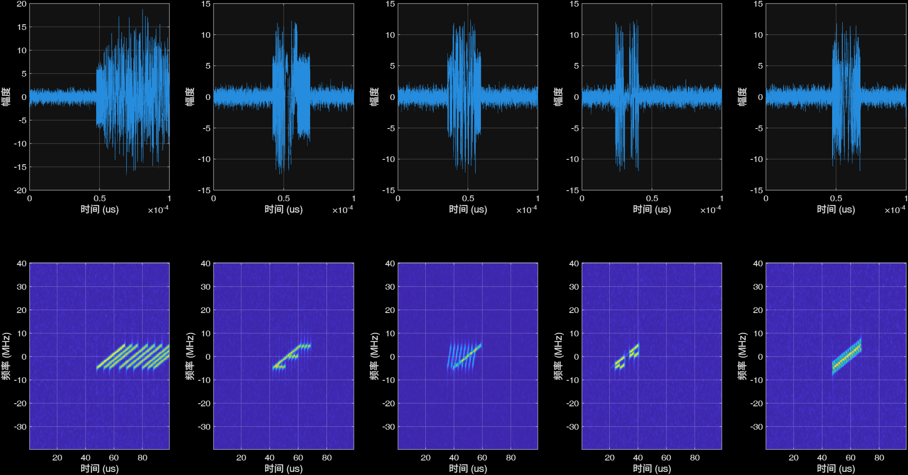
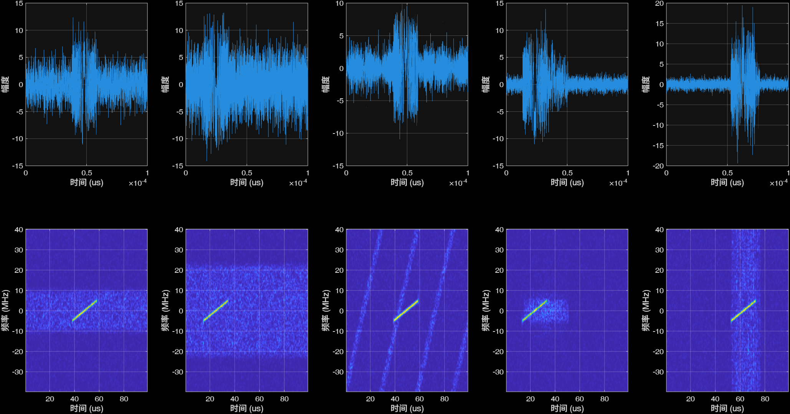
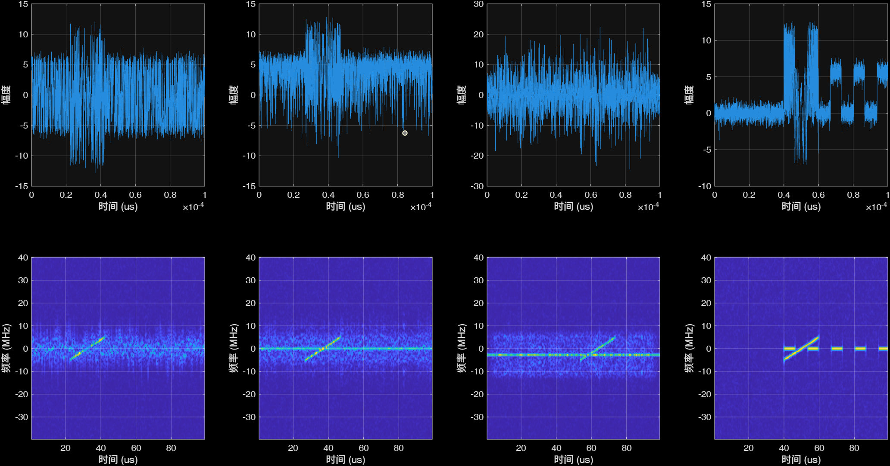

# 组合零样本小测试

## 欺骗+压制+组合3+3+9

train = ['DFTJ', 'ISRJ', 'SMSPJ', 'AJ', 'BJ','SJ']
val  = ['DFTJ', 'ISRJ', 'SMSPJ', 'AJ', 'BJ','SJ']
test   = ['DFTJ', 'ISRJ', 'SMSPJ', 'AJ', 'BJ','SJ'+九种组合]

设定为主瓣干扰，

样本个数:train 每个种类210个样本,val 90个,test 600个
7:3:20的比例
SNR = 15 dB，JNR = 0，10，20, 30，40, 50 dB
(目标信噪比是否需要一定的变化?)

HDF5‌ -v7.3保存
xx_echo_label.mat 多热标签
xx_echo_stfts.mat 时频域数据 每张图大小为124x64，complex single
xx_echo_times.mat 时域数据 每段回波长度为1x8000，complex single

self.classes = [
    'DFTJ',         # 密集假目标干扰
    'ISRJ',         # 间歇采样转发干扰
    'VDJ',          # 速度欺骗干扰
    'DDJ',          # 距离-速度联合欺骗干扰
    'AJ',           # 瞄准干扰
    'BJ',           # 阻塞干扰
    'SJ',           # 扫频干扰
    'NCJ',          # 噪声卷积干扰
    'NPJ',          # 噪声乘积干扰
    'SPSMJ',        # 弥散谱干扰
    'C&IJ',         # 切片交织干扰
    'NFMJ',         # 噪声频率调制干扰
    'NPMJ',         # 噪声相位调制干扰
    'NAMJ',         # 噪声幅度调制干扰
    'CSJ',          # 梳状谱干扰
    'PJ'            # 脉冲干扰
]
